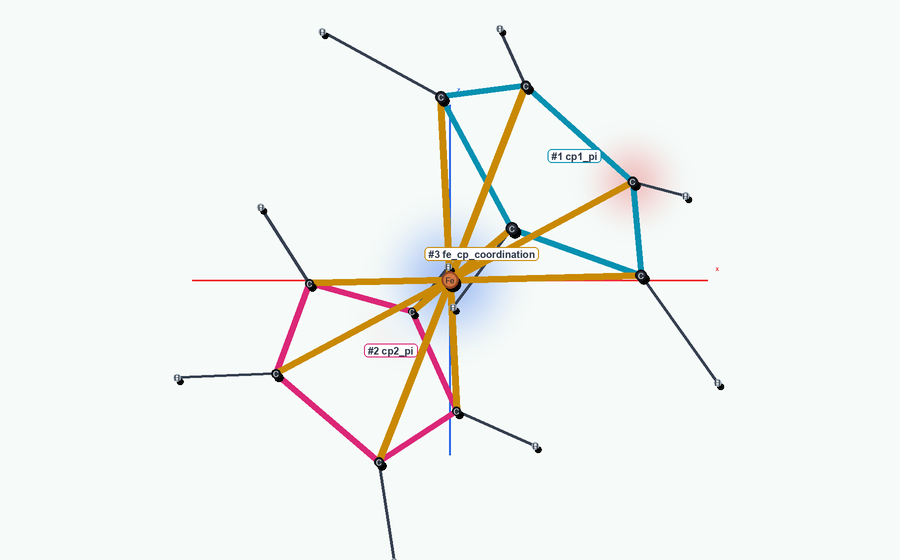
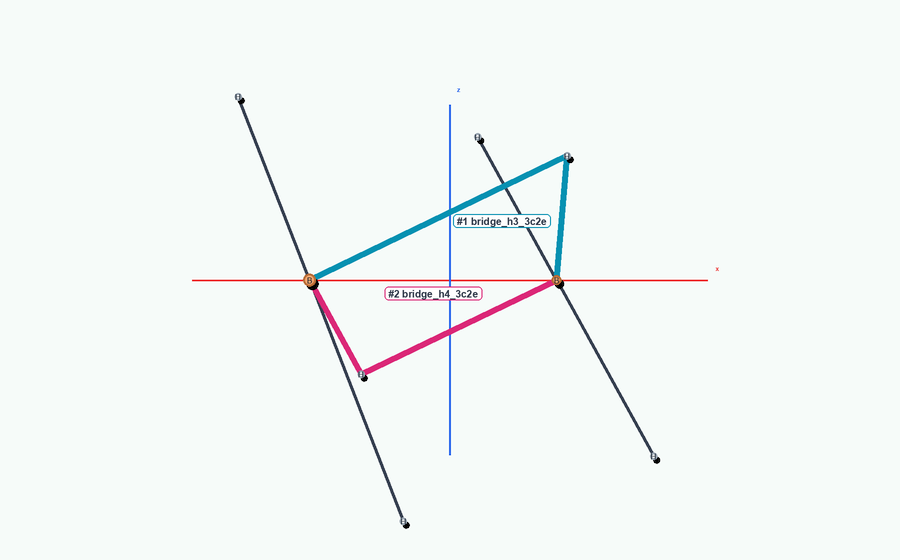

# MolADT-Bayes-Haskell

## Molecules, as data.

MolADT is a compact Haskell representation for molecules that need to be
inspected, validated, serialized, and scored by probabilistic models.

The boundary rule is:

- boundary formats stay at the edge
- the molecule stays in the ADT

<p align="center">
  
  
</p>

```text
Molecule = atoms + bonding systems + stereochemistry
```

[Quickstart](docs/quickstart.md) | [ADT](docs/data-model.md) |
[Representation](docs/representation.md) | [Examples](docs/examples.md) |
[Equality](docs/molecule-equality.md) | [CLI](docs/cli-and-demo.md) |
[Parsing](docs/parsing.md) | [Viewer](docs/parsing.md#viewer) | [Validator](#validator) |
[Inference](docs/inference.md) | [GP Features](docs/freesolv-gp-feature-list.md) |
[Feature Translations](docs/freesolv-gp-feature-layman.md)

## FreeSolv GP Model

The default FreeSolv benchmark path is now
`infer-benchmark freesolv_moladt_featurized mh:0.2`, the Haskell consumer for
the Python exported FreeSolv matrices. It replaces the older overfit
`freesolv-wl-system-gp` token model as the documented default:

- input features come from the Python `freesolv_moladt_featurized_X/y_*` CSV
  exports
- FreeSolv exported matrices use the Haskell exact RBF GP path
- the GP screens the training matrix to at most 30 MolADT features before
  inference
- predictions are posterior means and standard deviations for hydration free
  energy in kcal/mol

`make haskell-infer-benchmark` runs that 30-feature exported-matrix benchmark.
`make haskell-freesolv-20split` remains available as the additional
orbital-aware WL + bonding-system GP.

### Feature Map

The latest paper-facing Python model is `moladt_full30_rbf_gp`, an exact GP over
30 fixed MolADT-native features: composition and polarity signals, explicit
bonding-system counts, effective bond-order summaries, ring and rotatable-bond
structure, and short-range radial descriptors.
The full list is in [GP Features](docs/freesolv-gp-feature-list.md), with a
plain-English companion in
[Feature Translations](docs/freesolv-gp-feature-layman.md).

### Kernel Choice

The active Haskell benchmark uses the same dense-descriptor family as the
Python small-feature GP: standardized descriptors with an RBF kernel.

The kernel is:

```text
k(x, x') =
  signal_variance * exp(-||z(x) - z(x')||^2 / (2 * lengthscale^2))
```

The Haskell consumer samples the GP hyperparameters with the local inference
kernels and performs exact GP conditioning for predictions.

### Representation Ablation

The main empirical comparison lives in the Python repo because it owns the
FreeSolv paper artifacts. The latest committed 20-split A/B/C small-feature
result before the multigraph feature redo was:

| Label | Variant | Meaning | Test RMSE |
| --- | --- | --- | ---: |
| A | atom bag | 10 atom-count features | `1.971 +/- 0.567` |
| B | SMILES adjacency graph | 20 graph-only features | `1.791 +/- 0.505` |
| C | full MolADT | previous 20 graph features plus 10 MolADT descriptors | `1.308 +/- 0.461` |

Re-run the Python `make freesolv-ablation` target before citing an RMSE for the
current multigraph-first C-row feature contract.

## Why MolADT

String formats and plain graphs are useful, but limited:

- string formats are useful for exchange
- plain graphs are useful for traversal
- neither is a great home for all of the chemistry a model may need to reason
  about

MolADT keeps the important structure explicit:

- atoms with element data, coordinates, formal charge, shells, and orbitals
- every edge represented as a Dietz bonding system
- an edge network derived from bonding-system member edges
- delocalized and multicentre chemistry in the same bonding-system layer
- SMILES stereochemistry annotations as their own typed layer
- shared JSON serialization for Haskell and the sibling Python repo
- Haskell type classes for attaching laws and algebraic structure

That gives inference and inverse-design code:

- a molecule it can inspect directly
- fewer repeated notation-decoding steps
- a shared object for validation, descriptors, proposals, and scoring

Read more:

- [MolADT ADT Representation](docs/data-model.md)
- [MolADT Representation](docs/representation.md)
- [FreeSolv GP feature list](docs/freesolv-gp-feature-list.md)
- [FreeSolv GP feature translations](docs/freesolv-gp-feature-layman.md)

## The Shape

The core Haskell value is deliberately small:

```haskell
data Molecule = Molecule
  { atoms :: Map AtomId Atom
  , systems :: [(SystemId, BondingSystem)]
  , smilesStereochemistry :: SmilesStereochemistry
  }
```

`systems` is the canonical Dietz bonding layer:

- a single covalent bond is a one-edge `2e` `BondingSystem`
- a double covalent bond is a one-edge `4e` `BondingSystem`
- a triple covalent bond is a one-edge `6e` `BondingSystem`
- a quadruple covalent bond is a one-edge `8e` `BondingSystem`
- pretty printers and viewers display these as `single covalent`,
  `double covalent`, `triple covalent`, and `quadruple covalent`
- an ionic contact is a one-edge `0e` `BondingSystem`
- ionic contacts display as `ionic`
- formal charge stays on atoms rather than on the edge itself

Sodium chloride therefore has:

- `Na#1` at `+1`
- `Cl#2` at `-1`
- one `0e` `ionic` system over the Na-Cl edge

Pretty printing derives display edges from bonding systems:

- each edge row reports the total electrons shared over that edge
- each edge row reports the effective order
- a benzene C-C edge is shown as `shared=3e` and `order=1.50`
- that benzene value is `2e` from the one-edge `single covalent` system plus
  `1e/edge` from the six-electron `pi_ring`
- the viewer lists the same explicit bonding systems

System identifiers are stable display IDs:

- checked examples and parsers put named or multi-edge systems first
- benzene uses `SystemId 1` for `pi_ring`
- ordinary one-edge covalent systems are numbered after it

Shells and equality:

- shells are optional on atoms
- `elementAttributes` carries the default shell data used by simple constructors
- `elementAttributes` covers all 118 official elements for atomic number and
  mass; non-audited elements intentionally have no default shell object
- audited default shell tables are regression-tested against neutral atomic
  electron counts and representative orbital occupancy signatures
- use [`sameMolecule`](docs/molecule-equality.md) for equality modulo container
  ordering
- `sameMolecule` ignores ordering of maps, system lists, member-edge sets, and
  annotation lists
- atom and system identifiers still remain meaningful

The point is not to replace SMILES or SDF:

- SMILES and SDF stay useful as boundary formats
- parsers move those boundary formats into typed data
- the chemistry is then available as explicit ADT fields

Because this is Haskell, the representation is not just a convention:

- `AtomId`, `SystemId`, `NonNegative`, and `Angstrom` are separate types
- shells and orbitals are algebraic data types
- type classes can state behavior and laws around the molecule
- those laws do not require hiding the molecule fields

## What It Unlocks

- **Clearer chemistry**: diborane bridges, ferrocene Cp/metal systems, ionic salts, and
  morphine fused topology can be represented explicitly.
- **Safer boundaries**: SDF, SMILES, and JSON parsing happen at the edge, then
  validation runs on the typed molecule.
- **Shared contracts**: Haskell and Python use the same MolADT JSON shape for
  round-trips and benchmark exports.
- **Better model inputs**: the Haskell benchmark consumer works from
  Python-exported MolADT feature matrices rather than raw notation.
- **Editable structure**: inverse-design experiments can operate on atoms,
  hydrogens, and bonding systems as typed concepts.
- **Inspectable outputs**: the standalone viewer shows atoms, every edge, and
  explicit electron-sharing systems from the same typed payload. Charge renders
  as blue/red halos around charged atoms; halo size and opacity scale with
  formal-charge magnitude, atoms in ionic bonding systems get an additional
  boost, and ionic edges draw a charge gradient.
  Ordinary covalent edges are dark grey one/two/three/four-line strokes for
  single/double/triple/quadruple bonds, with those one-edge systems labelled in
  the side panel. When an edge belongs to more than one bonding system, each
  system overlay gets a dashed lane, including ordinary covalent versus
  delocalised overlap in ferrocene; non-standard systems are labelled as
  delocalised bonding and use coloured dashed overlays.
- **Algebraic contracts**: rotations, atom relabelings, or other transforms can
  be expressed with type classes as groups acting on molecules, giving
  geometric models a clear place to state invariance and equivariance.

See:

- [Example Molecules](docs/examples.md)
- [Parsing and Rendering](docs/parsing.md)
- [Type Classes And Group Actions](docs/representation.md#type-classes-and-group-actions)

## Why It Helps Benchmarking

MolADT is useful as a general explicit typed generative model for Bayesian
chemistry tasks. The model can work with molecules as structured values:

- priors can be written over atoms, edges, charges, rings, and bonding systems
- proposal kernels can make local typed edits instead of string rewrites
- generated molecules can be validated before scoring
- invalid chemistry can be rejected at the molecule boundary
- likelihoods and descriptors can inspect the same explicit object
- posterior samples can be serialized through the shared MolADT JSON contract

That is the point of the ADT:

- Bayesian inference works on the molecule itself
- inverse design works on the molecule itself
- notation decoding happens at boundaries, not on every move

## Validator

`validateMolecule` is a representation validator, not a physical chemistry
oracle. It rejects malformed MolADT values before parsing, viewing,
serialization, benchmark consumption, or inverse-design scoring continue.

It checks:

- atom map keys match `atomID`
- atom IDs and system IDs are positive
- coordinates and element metadata are finite
- system IDs are unique
- bonding systems are non-empty
- bonding-system edges reference existing atoms
- cached member atoms match member edges
- duplicate bonding systems are absent
- SMILES stereochemistry annotations only point at known atoms
- ordinary one-edge covalent systems with `2`, `4`, `6`, or `8` shared
  electrons are unnamed and display as single/double/triple/quadruple covalent
  bonds
- one-edge `0e` systems are tagged `ionic`
- `ionic` systems share zero electrons over exactly one edge

It deliberately does not:

- prove physical realism
- infer missing hydrogens
- choose protonation states
- decide whether a delocalised system is chemically preferred

Those are task-level constraints layered on top of the representation
validator.

## Start

```bash
make haskell-build
stack run moladtbayes -- parse molecules/benzene.sdf
stack run moladtbayes -- parse-smiles "c1ccccc1"
stack run moladtbayes -- pretty-example benzene
stack run moladtbayes -- pretty-example ferrocene
stack run moladtbayes -- pretty-example sodium_chloride
make haskell-viewer
```

For the full first-run path, use [Quickstart](docs/quickstart.md).

## Explore By Task

| Task | Go to |
| --- | --- |
| Understand the ADT | [ADT Representation](docs/data-model.md) |
| See why MolADT is not just a graph | [Representation](docs/representation.md) |
| Inspect benzene, morphine, diborane, ferrocene, or sodium chloride | [Examples](docs/examples.md) |
| Compare reordered molecules | [Molecule Equality](docs/molecule-equality.md) |
| Parse SDF, SMILES, or MolADT JSON | [CLI and Demo](docs/cli-and-demo.md) |
| Export a standalone HTML viewer | [Parsing and Rendering](docs/parsing.md#viewer) |
| Check parser scope and validation rules | [SMILES Scope and Validation](docs/smiles-scope-and-validation.md) |
| Run the Haskell benchmark consumer | [Inference](docs/inference.md) |
| Understand exported feature matrices | [Benchmarking Models and Exported Features](docs/models.md) |
| Inspect every FreeSolv GP feature name | [FreeSolv GP Feature List](docs/freesolv-gp-feature-list.md) |
| Read every FreeSolv GP feature in plain English | [FreeSolv GP Feature Translations](docs/freesolv-gp-feature-layman.md) |
| Work across the Python repo boundary | [Python Interop](docs/python-interop.md) |
| Find files quickly | [Repo Map](docs/repo-map.md) |
| Run tests | [Testing](docs/testing.md) |

## Commands

```bash
stack run moladtbayes -- --help
stack run moladtbayes -- to-json molecules/benzene.sdf > benzene.moladt.json
stack run moladtbayes -- from-json benzene.moladt.json
stack run moladtbayes -- view-html molecules/benzene.sdf --output results/viewer/benzene.viewer.html
stack run moladtbayes -- pretty-example benzene --viewer-output results/viewer/benzene.viewer.html
stack run moladtbayes -- pretty-example diborane --viewer-output results/viewer/diborane.viewer.html
stack run moladtbayes -- pretty-example sodium_chloride --viewer-output results/viewer/sodium-chloride.viewer.html
stack run moladtbayes -- to-smiles molecules/benzene.sdf
stack run moladtbayes -- infer-benchmark freesolv_moladt_featurized mh:0.2
stack run moladtbayes -- freesolv-wl-system-features --output docs/freesolv-wl-token-feature-list.md
make haskell-freesolv-20split
make haskell-freesolv-feature-list
make haskell-test
make haskell-viewer
make haskell-demo
make haskell-infer-benchmark
```

Viewer commands:

- print the HTML path
- print a portable `file://` URL
- use that URL as the manual fallback if OS auto-open fails
- support `--open-viewer` and `OPEN_VIEWER=1`

The Haskell benchmark path is intentionally narrow:

- it consumes the Python `freesolv_moladt_featurized` export
- the default path is `infer-benchmark freesolv_moladt_featurized mh:0.2`
- the exported-matrix GP screens to 30 features by default
- `make haskell-freesolv-20split` runs the additional WL-token GP
- `make haskell-freesolv-feature-list` writes the WL token vocabulary doc
- the Python repo owns the A/B/C representation ablation and paper artifacts

## Scope

This repo is:

- the typed Haskell implementation
- the aligned benchmark consumer

It includes:

- the MolADT molecule ADT
- conservative SDF and SMILES boundary parsing
- shared MolADT JSON serialization
- built-in typed molecule examples
- a compact FreeSolv inference and inverse-design path

For the Python side, use
[MolADT-Bayes-Python](https://github.com/oliverjgoldstein/MolADT-Bayes-Python)
for:

- the full benchmark pipeline
- data processing
- figures
- Python-side experiments
